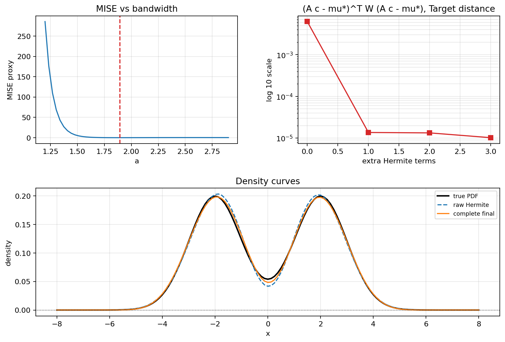

# Moment density estimator

Density reconstruction from **empirical moments** using a **generalized Hermite polynomial** estimator, **bandwidth selection** via an asymptotic MISE proxy, and **convex post-processing** (OSQP) to enforce approximate nonnegativity of the estimated density on a grid. Optional **moment completion** extends a truncated moment sequence.

## Pipeline (high level)

1. **Moments** — sample moments from a target distribution, or pass a fixed moment vector.
2. **Bandwidth `a`** — grid search minimizing `mise_estimator` (variance + squared bias proxy), or **smoothness in the MISE plateau**: restrict to the near-minimum MISE band on the same grid, scan `a` there, and pick the post-processed curve with smallest ∫(f'')² on the evaluation grid.
3. **Hermite coefficients** — map moments to coefficients with `hermite_coefficient`.
4. **Post-process** — solve a complete-only Hermite moment QP with OSQP to enforce approximate nonnegativity on a one-dimensional grid.
5. **Plots** — show the raw Hermite estimator and the complete-QP estimator; if a built-in true distribution is selected, also show the true PDF.

## Repository layout

| File | Role |
|------|------|
| `moment_density_estimator_complete.py` | Lightweight complete-only Hermite moment QP pipeline with no Fisher-local / max-entropy paths. |
| `moment_density_estimator_complete_demo.ipynb` | Paired notebook for the complete-only pipeline. |
| `run_moment_density_estimator_complete.py` | Command-line runner that loads moments or samples and writes CSV/JSON/PNG/PDF report outputs; pass `--dist` only when a true PDF is known. |

## Requirements

- Python 3.8+
- NumPy, SciPy, Matplotlib
- [OSQP](https://osqp.org/) for the positivity QP

Install (example):

```bash
pip install numpy scipy matplotlib osqp
```

## Quick start (local)

Download or clone the repository, then keep these three files in the same folder:

- `moment_density_estimator_complete.py`
- `moment_density_estimator_complete_demo.ipynb`
- `run_moment_density_estimator_complete.py`

### Notebook demo

Open `moment_density_estimator_complete_demo.ipynb` in Jupyter, VS Code, or Colab and run the cells from top to bottom. The notebook demonstrates the complete-only Hermite QP pipeline with five guiding distributions: `bimodal`, `normal`, `logistic`, `skewed`, and `su`.

You can switch the notebook example by changing:

```python
_example = "logistic"
```

### Command-line usage

Choose one of the five built-in guiding distributions:

```bash
python run_moment_density_estimator_complete.py --demo --dist bimodal --output-dir results/bimodal
python run_moment_density_estimator_complete.py --demo --dist normal --output-dir results/normal
python run_moment_density_estimator_complete.py --demo --dist logistic --output-dir results/logistic
python run_moment_density_estimator_complete.py --demo --dist skewed --output-dir results/skewed
python run_moment_density_estimator_complete.py --demo --dist su --output-dir results/su
```

Each built-in distribution uses a default bandwidth grid chosen for that example:

| Distribution | Default bandwidth grid |
|--------------|------------------------|
| `bimodal` | `np.linspace(1.2, 2.9, 50)` |
| `normal` | `np.linspace(1.4, 2.0, 50)` |
| `logistic` | `np.linspace(1.9, 2.7, 50)` |
| `skewed` | `np.linspace(2.0, 3.2, 50)` |
| `su` | `np.linspace(2.0, 3.2, 50)` |

Run the estimator from a moments file:

```bash
python run_moment_density_estimator_complete.py --moments example_moments.csv --prefix-len 9 --output-dir results --prefix my_report --dist normal
```

Run the estimator from a one-dimensional samples file:

```bash
python run_moment_density_estimator_complete.py --samples samples.csv --prefix-len 8 --max-moment-order 40 --output-dir results
```

Run a built-in demo:

```bash
python run_moment_density_estimator_complete.py --demo --output-dir results/demo
```

The script writes a CSV table, JSON metadata, PNG figures, and a PDF report. If the true distribution is unknown, omit `--dist`; if it is known, add one of the built-in `--dist` choices to include the true PDF in the plots. You can override the default bandwidth grid with `--a-min`, `--a-max`, and `--a-points`.

## Example output

The summary figure below is generated by the demo command:


